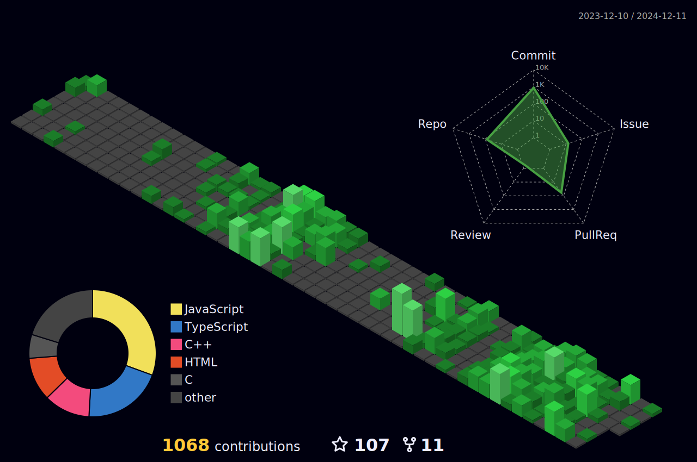

# Hi My name is Prayush Adhikari

## Web Developer and Data Science Enthusiast

I'm a full-stack web developer, proficient in PHP and Laravel for the backend, and React for frontend development. Alongside, I'm delving into C++ and AI, while leveraging my expertise in UI/UX design using tools like Adobe Illustrator and Figma. My goal is to create captivating web experiences that seamlessly integrate functionality and aesthetics.

- 🌍  I'm based in Nepal
- ✉️  You can contact me at [adhikareeprayush@gmail.com](mailto:ad@gmail.com)

### Skills

  

### Socials

 
  <a href="https://www.linkedin.com/in/prayushadhikari/">
    
  <a href="https://www.instagram.com/prayush_adh/">
    

`<b>`My GitHub Stats `</b>`

`<b>`Note:`</b>` Top languages is only a metric of the languages my public code consists of and doesn't reflect experience or skill level.

<a href="https://github.com/adhikareeprayushgithub-readme-activity-graph">``</a>

