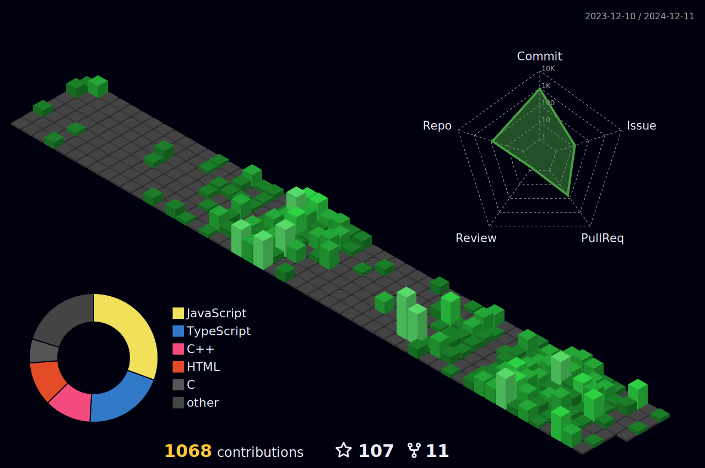

# 👋 Hey there! I'm Prayush Adhikari

 

## 🚀 About Me

I'm a **Computer Engineering undergraduate** passionate about building scalable web applications and solving complex problems. I specialize in the **MERN stack** and have a strong foundation in **Java** and **system programming**.

🎯 **Current Focus:** Building full-stack applications with modern DevOps practices  
💡 **Learning:** Advanced system design, microservices, and cloud architecture  
🎨 **Design:** Creating intuitive user experiences with Figma and modern UI principles  
🧠 **Problem Solving:** Active on LeetCode, strengthening DSA fundamentals

### 📍 Quick Facts

- 🎓 Computer Engineering Student from **Nepal** 🇳🇵
- 💻 MERN Stack Developer with **Java** expertise
- ⚡ Strong foundation in **C/C++** and system programming
- 🎨 UI/UX Designer using **Figma**
- 🧠 DSA enthusiast solving problems on **LeetCode**
- ☁️ Learning **DevOps** and cloud technologies

 

---

## 🛠️ Tech Stack

### 🌐 Frontend

### ⚙️ Backend

### 💻 Programming Languages

### ☁️ DevOps & Cloud

### 🎨 Design & Tools

---

## 📊 GitHub Stats

  
  

  

## 🧠 Problem Solving

  

---

## 🏆 Achievements

  

## 📈 Contribution Graph

  

## 🎯 3D Contribution Visualization

  

---

## 🌐 Connect with Me

 

---

### 💭 Daily Inspiration

### ☕ Coding Philosophy

_"Clean code always looks like it was written by someone who cares."_

**Thanks for visiting! Let's build something amazing together! 🚀**

